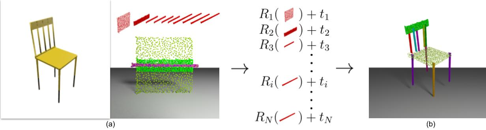

# Learning 3D Part Assembly from a Single Image

This repository contains a PyTorch implementation of the paper:

[Learning 3D Part Assembly from A Single Image](https://arxiv.org/abs/2003.09754). 
<br>
[Yichen Li*](http://cs.stanford.edu/~liyichen/), 
[Kaichun Mo*](http://cs.stanford.edu/~kaichun/),
[Lin Shao](https://linsats.github.io/),
[Minhyuk Sung](https://mhsung.github.io/),
[Leonidas Guibas](https://geometry.stanford.edu/member/guibas/),
<br>
ECCV 2020


## Introduction

Autonomous assembly is a crucial capability for robots in many applications. For this task, several problems such as obstacle avoidance, motion planning, and actuator control have been extensively studied in robotics. However, when it comes to task specification, the space of possibilities remains underexplored. Towards this end, we introduce a novel problem, single-image-guided 3D part assembly, along with a learningbased solution. We study this problem in the setting of furniture assembly from a given complete set of parts and a single image depicting the entire assembled object. Multiple challenges exist in this setting, including handling ambiguity among parts (e.g., slats in a chair back and leg stretchers) and 3D pose prediction for parts and part subassemblies, whether visible or occluded. We address these issues by proposing a two-module pipeline that leverages strong 2D-3D correspondences and assembly-oriented graph message-passing to infer part relationships. In experiments with a PartNet-based synthetic benchmark, we demonstrate the effectiveness of our framework as compared with three baseline approaches.

<p float="left">
    
</p>

## Dependencies
* Python 3.6
* CUDA 10.0.
* [PyTorch](http://pytorch.org/). code tested with version 1.3.1
* [Blender](https://www.blender.org/). for visualization of results
* (Optional) [Tensorboard](https://www.tensorflow.org/) for visualization of the training process. 
* For the project it has been used [TensorboardX](https://github.com/lanpa/tensorboard-pytorch) 
```
pip install -r requirements.txt
```

* Chamfer Distance
```
cd exps/utils/cd
python setup.py install
```

## Dataset 
Data is available here: [link](http://download.cs.stanford.edu/orion/impartass/assembly_data.zip).
```
wget http://download.cs.stanford.edu/orion/impartass/assembly_data.zip
```

## Training

#### Training the segmentation stage first
```
cd exps/exp_segmentation
sh train.sh 
```
modify your parameters including data_path, exp_name and etc.
(see closed issues for details info)

#### Training the assembly stage
```
cd exps/exp_assemble
sh train.sh 
```

## Pre-trained models

Pretrained weights for the chair category is available at [link](http://download.cs.stanford.edu/orion/impartass/chair_weights.zip). 
```
wget http://download.cs.stanford.edu/orion/impartass/chair_weights.zip
```


## Cite
Please cite our work if you find it useful:
```latex
@article{li2020impartass,
    title={Learning 3D Part Assembly from a Single Image},
    author={Li, Yichen and Mo, Kaichun and Shao, Lin and Sung, Minghyuk and Guibas, Leonidas},
    journal={European conference on computer vision (ECCV 2020)},
    year={2020}
}
```

